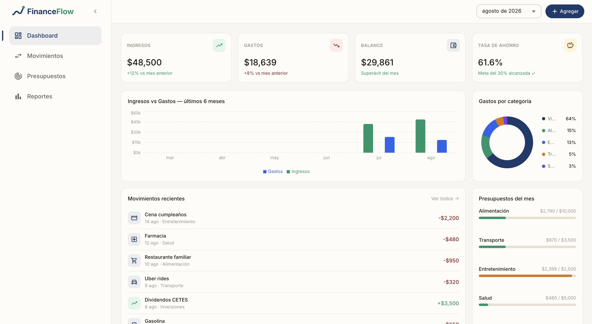
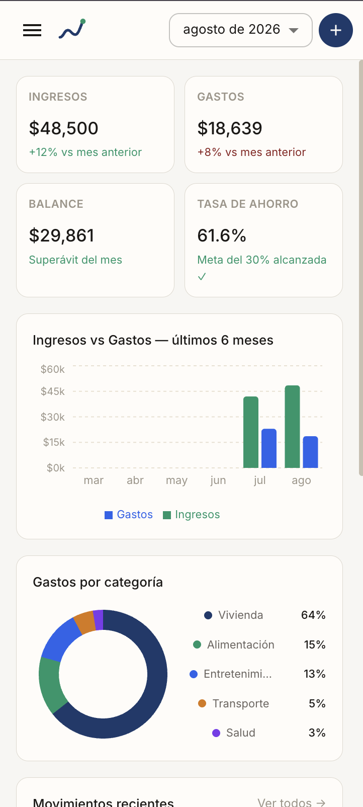

# FinanceFlow

**FinanceFlow** is a personal finance web application built with **Next.js 16**, **React 19**, and **Material UI**, with 100% local persistence via **IndexedDB** (through Dexie.js). It lets you record income and expenses, set monthly budgets per category, visualize trends with charts, and export reports as CSV and PDF with a formal statement-style design.

It requires no backend, no remote database, and no authentication: all data lives in the user's browser.

---

## Table of Contents

- [Preview](#preview)
- [Key Features](#key-features)
- [Tech Stack](#tech-stack)
- [Architecture](#architecture)
  - [Data Model and Persistence](#data-model-and-persistence)
  - [Folder Structure](#folder-structure)
  - [Application Layers](#application-layers)
  - [Global State Management](#global-state-management)
  - [Design System (Theming)](#design-system-theming)
  - [Layout shell: Sidebar + Navbar](#layout-shell-sidebar--navbar)
  - [PDF Export](#pdf-export)
  - [Responsive Design](#responsive-design)
- [Application Pages](#application-pages)
- [Getting Started](#getting-started)
- [Available Scripts](#available-scripts)
- [Predefined Categories](#predefined-categories)
- [Design Decisions and Known Limitations](#design-decisions-and-known-limitations)

---

## Preview

| Desktop | Mobile |
| --- | --- |
|  |  |

The layout is fully responsive: the navigation sidebar is persistent and collapsible on desktop, and turns into a sliding drawer on mobile; tables reorganize into stacked cards, and card grids go from 4 columns down to 1–2 depending on the available width.

---

## Key Features

- **Dashboard** with summary cards (income, expenses, balance, savings rate), a 6-month trend chart, expense distribution by category, recent transactions, and monthly budget progress — all in a single view.
- **Transactions**: adding income/expenses with validation (Zod + React Hook Form), filters by type/category/date range/text, a paginated table (12 records per page) with no page scroll.
- **Budgets**: monthly limits per expense category with a progress bar, "exceeded"/"near limit" status, and creation with a confirmation modal.
- **Reports**: 6-month trend, expense distribution, and top 5 expense categories.
- **Export**:
  - Plain **CSV**, ready to open in Excel/Sheets.
  - **Formal statement-style PDF**, generated 100% client-side with `jsPDF` + `jspdf-autotable`: letterhead with folio number and issue date, a summary, two vector charts (monthly trend and top categories drawn by hand with `jsPDF` primitives, no screenshots), an automatically paginated detail table, and an invoice-style final total.
- **Confirmation modals** before saving a transaction or budget, with a color-coded summary (green/red/blue) of what is about to be saved.
- **Dynamic toasts** (MUI's Snackbar + Alert, themed) confirming the action with details of the transaction/budget that was added.
- **Global month selector** (React Context) that filters the Dashboard, Budgets, and Reports in sync.
- **Collapsible sidebar** with a smooth transition, icons that never shift when collapsing/expanding, and the preference persisted in `localStorage`.
- **No page scroll**: the application shell occupies exactly the height of the viewport; content that doesn't fit scrolls within its own container, never the window.
- **Custom visual theme**: a warm palette (cream/navy/gold), free of Material UI's generic default patterns — colors, typography, radii, and shadows centralized in a single theme file.

---

## Tech Stack

| Category | Technology | Purpose |
| --- | --- | --- |
| Framework | [Next.js 16](https://nextjs.org/) (App Router, Turbopack) | Routing and build |
| UI | [React 19](https://react.dev/) | Components |
| Component library | [MUI 9](https://mui.com/) (`@mui/material`, `@mui/icons-material`) | Base design system |
| Styling | Emotion (MUI's styling engine) | CSS-in-JS |
| Persistence | [Dexie.js](https://dexie.org/) on top of IndexedDB | Local database in the browser |
| Forms | [React Hook Form](https://react-hook-form.com/) + [Zod](https://zod.dev/) (`@hookform/resolvers`) | Form validation |
| Charts (UI) | [Recharts](https://recharts.org/) | Bars and donut chart on the Dashboard/Reports |
| Export | [jsPDF](https://github.com/parallax/jsPDF) + [jspdf-autotable](https://github.com/simonbengtsson/jsPDF-AutoTable) | Client-side PDF generation |
| Dates | [date-fns](https://date-fns.org/) | Date utilities (dependency available; primary formatting via `Intl`) |
| Language | TypeScript 5 (`strict: true`) | Static typing |
| Linting | ESLint 9 (`eslint-config-next`) | Code quality |

---

## Architecture

### Data Model and Persistence

FinanceFlow **has no backend**. All information is saved directly in the browser using **IndexedDB**, wrapped by Dexie.js to provide an ORM-like API with reactive queries.

```ts
// src/lib/db.ts
class FinanceDB extends Dexie {
  transactions!: Table<Transaction, number>
  budgets!: Table<Budget, number>
}
```

Queries are consumed via `dexie-react-hooks` (`useLiveQuery`), which means **any change to the database automatically re-renders** every subscribed component, without needing a global store like Redux/Zustand. This is what allows, for example, adding a transaction to instantly update the Dashboard, Reports, and the Transactions table all at once.

The first time the app starts (`Providers.tsx` → `seedIfEmpty()`), the database is seeded with sample data (transactions and budgets for the current and previous month) so the user can see the app working without any prior setup.

**Entities:**

```ts
type TransactionType = 'income' | 'expense'

interface Transaction {
  id?: number
  type: TransactionType
  amount: number
  categoryId: string
  description: string
  date: string        // 'YYYY-MM-DD'
  notes?: string
  createdAt: string    // ISO timestamp
}

interface Budget {
  id?: number
  categoryId: string
  limit: number
  month: string        // 'YYYY-MM'
}

interface Category {
  id: string
  name: string
  type: TransactionType
  icon: string
  color: string
}
```

Input validation (forms) is handled with **Zod** schemas (`src/lib/schemas.ts`), including type coercion (`z.coerce.number()`) so that HTML inputs — which always return strings — are safely converted to numbers before being saved.

### Folder Structure

```
src/
├── app/                        # Next.js App Router
│   ├── layout.tsx              # Root shell: Sidebar + Navbar + <main>, global providers
│   ├── page.tsx                # Dashboard ("/")
│   ├── globals.css             # Reset + window scroll lock
│   ├── transactions/page.tsx   # Transactions (paginated table, filters, CSV/PDF export)
│   ├── budgets/page.tsx        # Budgets (creation + progress cards)
│   └── reports/page.tsx        # Reports (trends and top categories)
│
├── components/
│   ├── layout/
│   │   ├── Sidebar.tsx          # Collapsible side nav (desktop) + Drawer (mobile)
│   │   ├── Navbar.tsx           # Header: mobile menu, month selector, "Add" button
│   │   ├── BrandMark.tsx        # Reusable logo/wordmark (monogram "F")
│   │   └── Providers.tsx        # ThemeProvider + ToastProvider + MonthProvider + data seeding
│   ├── dashboard/
│   │   ├── SummaryCards.tsx     # 4 cards: income, expenses, balance, savings rate
│   │   ├── RecentTransactions.tsx
│   │   └── BudgetProgress.tsx
│   ├── charts/
│   │   ├── MonthlyBarChart.tsx  # Recharts: income vs. expense bars
│   │   └── CategoryPieChart.tsx # Recharts: expense-by-category donut
│   ├── transactions/
│   │   ├── TransactionForm.tsx  # Form + confirmation flow + toast
│   │   └── TransactionModal.tsx # Dialog container for the form
│   └── common/
│       └── ConfirmDialog.tsx     # Generic, reusable confirmation modal
│
├── hooks/
│   ├── useFinance.ts            # Reactive queries (Dexie) + CRUD actions
│   ├── useMonth.tsx             # Context: selected month, shared across the app
│   └── useToast.tsx             # Context: notification system (Snackbar/Alert)
│
├── lib/
│   ├── db.ts                    # Dexie database definition + seeding
│   ├── finance.ts               # Categories, formatters, exportToCSV, exportToPDF
│   ├── schemas.ts                # Zod schemas (transaction, budget)
│   └── theme.ts                  # Centralized MUI theme (palette, typography, overrides)
│
└── types/
    └── finance.ts                # Shared types (Transaction, Budget, Category, ...)
```

### Application Layers

```
┌─────────────────────────────────────────────────────────┐
│  Pages (app/*)                                            │
│  Orchestrate hooks + components, no business logic        │
└───────────────┬───────────────────────────┬───────────────┘
                │                           │
┌───────────────▼───────────────┐ ┌─────────▼─────────────┐
│  Components (components/*)     │ │  Hooks (hooks/*)        │
│  Presentation + interaction     │ │  State + data access   │
└───────────────┬───────────────┘ └─────────┬─────────────┘
                │                           │
┌───────────────▼───────────────────────────▼───────────────┐
│  lib/finance.ts, lib/schemas.ts                            │
│  Business rules: formatting, validation, export             │
└───────────────┬─────────────────────────────────────────────┘
                │
┌───────────────▼─────────────────────────────────────────────┐
│  lib/db.ts (Dexie) → browser IndexedDB                       │
└───────────────────────────────────────────────────────────────┘
```

There is no API/network layer: each page calls the `useFinance.ts` hooks directly, which in turn read/write to Dexie. This greatly simplifies the data flow at the cost of not syncing data across devices (see [known limitations](#design-decisions-and-known-limitations)).

### Global State Management

Instead of a state management library (Redux, Zustand, etc.), the app uses **two React Contexts**, each with a single, focused responsibility:

| Context | File | Responsibility |
| --- | --- | --- |
| `MonthProvider` / `useMonth()` | `hooks/useMonth.tsx` | Month selected in the Navbar; consumed by the Dashboard, Budgets, and Reports to filter their data in sync. |
| `ToastProvider` / `useToast()` | `hooks/useToast.tsx` | Queue of Snackbar-style notifications; exposes `showToast({ message, description, severity })` to any component. |

Both are mounted once in `components/layout/Providers.tsx`, wrapping the entire application:

```tsx
<ThemeProvider theme={theme}>
  <CssBaseline />
  <ToastProvider>
    <MonthProvider>{children}</MonthProvider>
  </ToastProvider>
</ThemeProvider>
```

The rest of the state (transaction table filters, pagination, forms, modal open/close state) is local to each component via `useState`, since it doesn't need to be shared across screens.

### Design System (Theming)

The entire look & feel lives in **a single file**, `src/lib/theme.ts`, which extends MUI's default theme (`createTheme`) with:

- **A custom palette** (cream/navy/gold) instead of MUI's default blues/purples:

  | Token | Color | Usage |
  | --- | --- | --- |
  | `primary` | `#1B3A6B` (navy) | Brand, primary buttons, accents |
  | `background.default` | `#F5F0E8` (cream) | App background |
  | `background.paper` | `#FEFCF8` | Cards, dialogs |
  | `success` | `#1A6B45` | Income, confirmations |
  | `error` | `#8B2020` | Expenses, errors |
  | `divider` | `#DDD8CE` | Subtle borders |

- **Per-component `styleOverrides`** (`MuiCard`, `MuiButton`, `MuiChip`, `MuiDialog`, `MuiAlert`, etc.) so that every instance of an MUI component across the app shares border radii, shadows, and typography without repeating `sx` on each use.
- **Typography**: Inter (via `next/font/google`) with weights and `letter-spacing` tuned to feel like a bespoke product rather than a generic template.

This centralized approach is what made it possible, for example, to standardize the font size of all inputs (`MuiInputBase`) with a single change when an inconsistency was spotted across pages.

### Layout shell: Sidebar + Navbar

The application shell (`app/layout.tsx`) builds a structure with a **fixed height equal to the viewport**, with no window scroll:

```
┌──────────┬──────────────────────────────┐
│          │  Navbar (58px, sticky)        │
│ Sidebar  ├──────────────────────────────┤
│ (persist.│                                │
│  md+ /   │  <main> — flex:1               │
│  drawer  │  overflow-y: auto              │
│  on xs)  │  (content of each page)        │
│          │                                │
└──────────┴──────────────────────────────┘
```

- **Sidebar** (`Sidebar.tsx`): persistent on `md+`, collapsible (232px ↔ 76px) with a `width` transition — icons live in a **fixed-size slot** that never changes between states, so only the text appears/disappears via opacity; nothing "jumps." On mobile it's hidden and replaced by a temporary `Drawer` triggered from the Navbar's menu icon. The collapsed/expanded state persists in `localStorage`.
- **Navbar** (`Navbar.tsx`): sticky, with the global month selector and the "Add transaction" button. On mobile it compacts (hides the brand text, narrows the selector, reduces the add button to an icon-only button) to avoid overflowing small screens.
- **`<main>`**: is the **only scrollable container** in the entire app (`overflow-y: auto`, `flex: 1`, `min-height: 0`). `<body>` and `<html>` have `overflow: hidden` — which is why the app never "bounces" or shows blank strips when scrolling with a trackpad.
- The **Transactions** page additionally fixes its own height to `calc(100vh - 58px)` and paginates the table (12 rows), so even its internal container doesn't need to scroll in the normal case.

### PDF Export

`exportToPDF()` (in `lib/finance.ts`) generates a PDF **entirely in the browser**, with no server calls, using `jsPDF` to draw directly with vector primitives (rectangles, lines, text) and `jspdf-autotable` for the detail table. The document follows a **statement/invoice-style** format:

1. Letterhead with the brand, an auto-generated folio number (`FF-YYYYMMDD-HHMM`), and the issue date.
2. Metadata strip: period covered, number of transactions, net balance.
3. Summary with thin borders: income / expenses / balance.
4. **Two hand-drawn charts** (no screenshots or image conversion involved): grouped bars of income vs. expenses per month, and horizontal bars for the top 5 expense categories — using the same category colors as the UI.
5. Detail table with automatic pagination across sheets.
6. Invoice-style final total (income, expenses, balance) on the last page.
7. Footer with "Page X of Y" on every sheet.

`exportToCSV()`, on the other hand, generates a plain CSV with a UTF-8 BOM so accented characters open correctly in Excel.

### Responsive Design

MUI breakpoints used: `xs` (<600px, mobile), `sm` (600–900px), `md` (≥900px, where the persistent sidebar appears). Patterns applied consistently across the app:

- **Card grids** (`SummaryCards`, Dashboard/Budgets/Reports cards) go from 4/2 columns to a single stacked column on mobile via a responsive `gridTemplateColumns`.
- **Table → cards**: the Transactions table, with fixed-pixel-width columns, is replaced on mobile by stacked cards (description + amount on top, category + date + delete below) instead of squeezing unreadable columns.
- **Filter/creation forms** wrap (`flexWrap`) and their fields switch to full width on small screens.
- **Dialogs** reduce their margin relative to the viewport on mobile to make better use of the space.

---

## Application Pages

| Route | Page | Description |
| --- | --- | --- |
| `/` | Dashboard | Monthly overview: KPI cards, 6-month trend, distribution by category, recent transactions, and budget progress. |
| `/transactions` | Transactions | Creation, filtering, pagination, and export (CSV/PDF) of all transactions. |
| `/budgets` | Budgets | Setting monthly limits per expense category and visually tracking consumption. |
| `/reports` | Reports | 6-month trend, expense distribution, and top 5 categories with percentage of total. |

---

## Getting Started

### Requirements

- Node.js 20 or higher
- npm (the project includes `package-lock.json`)

### Installation

```bash
git clone <repository-url>
cd financeflow
npm install
```

### Development

```bash
npm run dev
```

Open [http://localhost:3000](http://localhost:3000). The project uses **Turbopack** as the development bundler (included in Next.js 16).

### Production

```bash
npm run build
npm run start
```

---

## Available Scripts

| Script | Command | Description |
| --- | --- | --- |
| `dev` | `next dev` | Development server with hot-reload (Turbopack) |
| `build` | `next build` | Production build |
| `start` | `next start` | Serves the production build |
| `lint` | `eslint` | Project linting |

> The project uses TypeScript in `strict` mode. It's recommended to run `npx tsc --noEmit` before pushing large changes, since there isn't a dedicated `typecheck` script.

---

## Predefined Categories

Defined in `src/lib/finance.ts` (`CATEGORIES`), each with its own color used consistently across charts, chips, and the PDF:

**Income:** Salary, Investments, Freelance, Other income
**Expenses:** Housing, Food, Transportation, Entertainment, Health, Education, Clothing, Other expenses

---

## Design Decisions and Known Limitations

- **No backend or sync**: since data lives in IndexedDB, it is local to the browser/device. Clearing site data or switching browsers means losing the information (there is no export/import of the full database, only of reports).
- **No authentication**: the app is intended for personal use on a single device, not multi-user.
- **Single language** (Spanish, `es-MX`) and a single currency (MXN) in the formatters in `lib/finance.ts`.
- **Partial persistence of preferences**: only the sidebar's collapsed/expanded state is saved to `localStorage`; the selected month and filters reset on page reload.
